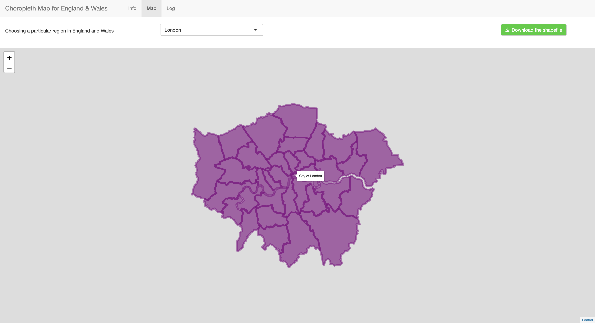

# Drawing Choropleth Map for Regions in England And Wales

### Introduction

In this Shiny page, you can download shapefiles for each region (in terms of local authorities) in England and Wales.



Shapefile data (May 2024) and Local Authority District to Region (December 2023) were downloaded from data.gov.uk.

Head over to Map tab, select a region in England and Wales (e.g., London) and download the corresponding shapefiles (as .zip file)!

Also, you can hover/click on each polygon (with the name of corresponding Local Authority) in the choropleth map.

Inside the zip file, there are four files with extensions (.shp, .shx, .dbf and .prj).

Store all these files in a directory and create corresponding choropleth map with [sf](https://r-spatial.github.io/sf/) and [leaflet](https://rstudio.github.io/leaflet/articles/leaflet.html) packages in R.

Have a look at the following example code of creating a choropleth map with shapefiles of London (shapefile_London.shp):

``` r
# Load packages
library(sf)
library(leaflet)

# Import data
sf <- read_sf('shapefile_London.shp')

# Draw the map
leaflet(sf) %>% 
  addPolygons(data=sf$geometry, 
              color = 'purple', 
              fillOpacity = 0.6, 
              smoothFactor = 0.5, 
              label = sf$LAD24NM)
```

### Remarks

This Shiny page, which uses relevant materials of digital boundary products supplied under the Open Government Licence, provide the following copyright statements:

-   Sources: Office for National Statistics licensed under the Open Government Licence v.3.0

-   Contains OS data © Crown copyright and database right [2024]
